# Ora Language v1.0 "Asuka" - Showcase

> **🚀 First Production Release** - Real EVM Smart Contract Compilation   
> **🎯 Status**: Production-Ready Compiler Pipeline

---

## 🏗️ **Compilation Pipeline**

The Ora compiler features a complete, robust compilation pipeline from source to deployable EVM bytecode:

```mermaid
graph TD
    A["🔤 Ora Source Code<br/>(.ora files)"] --> B["🔍 Lexical Analysis<br/>(353 tokens)"]
    B --> C["🌳 Parser<br/>(AST Generation)"]
    C --> D["📊 Semantic Analysis<br/>(95% Complete)"]
    D --> E["🔍 Type Checking<br/>(Memory Safety)"]
    E --> F["🏗️ HIR Generation<br/>(High-level IR)"]
    F --> G["✅ IR Validation<br/>(Error Recovery)"]
    G --> H["⚡ Yul Generation<br/>(3,961 bytes)"]
    H --> I["🎯 EVM Bytecode<br/>(986 bytes)"]
    I --> J["🚀 Deployable<br/>Smart Contract"]

    style A fill:#e1f5fe
    style J fill:#c8e6c9
    style D fill:#fff3e0
    style E fill:#fff3e0
    style F fill:#f3e5f5
    style H fill:#e8f5e8
    style I fill:#ffebee
```



### **🎯 Pipeline Capabilities**

- **✅ Complete Source-to-Bytecode**: One command compilation
- **✅ Real EVM Output**: Deployable smart contracts (986 bytes for ERC20)
- **✅ Memory Safety**: Comprehensive validation throughout pipeline
- **✅ Standard Library**: Built-in Ethereum context access
- **✅ Error Recovery**: Graceful error handling without crashes

---

## 🎨 **Language Features**

### **📋 Core Type System**

```ora
// Primitive Types
let balance: u256 = 1000000;           // 256-bit integers
let owner: address = 0x742d35cc...;   // Ethereum addresses  
let active: bool = true;               // Booleans
let name: string = "MyToken";          // Dynamic strings
let data: bytes32 = 0xabcd...;         // Fixed byte arrays

// Complex Types
let amounts: map[address, u256];                    // Mappings
let approvals: doublemap[address, address, u256];  // Nested mappings
let holders: Array[address];                        // Dynamic arrays

// Advanced Types
let result: Result[u256, string];      // Result types for error handling
let maybe_error: !u256;                // Error unions (!T syntax)
let coordinates: (u256, u256, bool);   // Tuple types
```

### **🏗️ Contract Structure**

```ora
contract ERC20 {
    // Storage Variables (Persistent State)
    storage const name: string;           // Immutable after constructor
    storage var total_supply: u256;       // Mutable contract state
    storage var balances: map[address, u256];
    
    // Events (EVM Log Emissions)
    log Transfer(from: address, to: address, value: u256);
    
    // Constructor
    pub fn init(token_name: string, initial_supply: u256) {
        name = token_name;                // ✅ Constructor assignment allowed
        total_supply = initial_supply;
    }
    
    // Public Functions (External Interface)
    pub fn transfer(to: address, amount: u256) -> bool {
        // ✅ Standard library access
        balances from std.transaction.sender -> to : amount;
        log Transfer(std.transaction.sender, to, amount);
        return true;
    }
}
```

### **🏗️ Struct Definitions & Memory Packing**

```ora
// Ora compiler can change the order to better align the data
struct UserProfile {
    id: u64,                    // 8 bytes
    active: bool,               // 1 byte (packed with next field)
    level: u8,                  // 1 byte (packed efficiently)
    balance: u256,              // 32 bytes (aligned)
    created_at: u64,            // 8 bytes
}

// Struct instantiation
let profile = UserProfile{
    id: 12345,
    active: true,
    level: 5,
    balance: 1000000,
    created_at: std.block.timestamp
};

// Field access with automatic memory layout optimization
let user_balance = profile.balance;          // ✅ Efficient field access
profile.level = 10;                          // ✅ Mutable field update
```

### **🎯 Enum Types with Discriminants**

```ora
// Simple enum with automatic discriminants
enum TokenType {
    ERC20,      // discriminant: 0
    ERC721,     // discriminant: 1
    ERC1155     // discriminant: 2
}

// Enum with custom base type and explicit values
enum Status : u8 {
    Pending = 0,
    Active = 1,
    Suspended = 2,
    Terminated = 255
}

// Enum usage with pattern matching
let token_status = Status.Active;
if (token_status == Status.Pending) {
    // Handle pending state
}

// Enum comparison based on discriminant values  
let is_higher_priority = Status.Active > Status.Pending;  // ✅ true
```

### **🔐 Memory Regions**

Ora provides explicit memory management with different storage regions:

```ora
// Storage Region (Persistent blockchain state)
storage const MAX_SUPPLY: u256 = 1000000;    // Contract constants
storage var balances: map[address, u256];     // Persistent mappings

// Stack Region (Temporary function variables)  
let temp_value: u256 = calculate_fee();       // Local computations

// Memory Region (Temporary structured data)
memory var temp_array: Array[u256];           // Dynamic temporary data

// Immutable Region (Set once at deployment)
immutable OWNER: address;                     // Deploy-time constants
```

---

## 🛡️ **Safety & Validation**

### **✅ Semantic Analysis (95% Complete)**

- **Storage Const Validation**: Proper constructor initialization checking
- **Memory Safety**: Comprehensive pointer and memory validation  
- **Type Compatibility**: Full type checking with error recovery
- **Standard Library**: Complete `std.transaction` and `std.constants` support

### **🔒 Constructor Validation**

```ora
contract Token {
    storage const name: string;        // ✅ Must be initialized in constructor
    storage const decimals: u8;        // ✅ Cannot be changed after init
    
    pub fn init(token_name: string) {
        name = token_name;             // ✅ Constructor assignment allowed
        decimals = 18;                 // ✅ One-time initialization
    }
    
    pub fn change_name() {
        name = "NewName";              // ❌ Error: Cannot assign outside constructor
    }
}
```

### **🌐 Standard Library Access**

```ora
pub fn transfer(to: address, amount: u256) -> bool {
    // ✅ Transaction context access
    let sender = std.transaction.sender;    // Current caller address
    let value = std.transaction.value;      // Sent ETH amount
    
    // ✅ Blockchain constants  
    let zero_addr = std.constants.ZERO_ADDRESS;  // 0x000...000
    let max_int = std.constants.MAX_UINT256;     // 2^256 - 1
    
    // ✅ Block information
    let timestamp = std.block.timestamp;    // Current block time
    let number = std.block.number;          // Current block number
    
    return true;
}
```

---

## 🧮 **Advanced Mathematics & Error Handling**

### **🔢 Arithmetic Operations**

```ora
// Safe arithmetic with overflow protection
let a: u256 = 1000;
let b: u256 = 500;

let sum = a + b;           // Addition: 1500
let diff = a - b;          // Subtraction: 500  
let product = a * b;       // Multiplication: 500000
let quotient = a / b;      // Division: 2
let remainder = a % b;     // Modulo: 0

// Compound assignment
balance += amount;         // balance = balance + amount
supply -= burned;          // supply = supply - burned
```

### **🔢 Specialized Division Operations**

```ora
// Advanced division functions with safety guarantees
let dividend: i256 = -17;
let divisor: i256 = 5;

// @divTrunc: Truncating division (toward zero) - Default EVM behavior
let trunc_result = @divTrunc(dividend, divisor);    // Result: -3

// @divFloor: Floor division (toward negative infinity)  
let floor_result = @divFloor(dividend, divisor);    // Result: -4

// @divCeil: Ceiling division (toward positive infinity)
let ceil_result = @divCeil(dividend, divisor);      // Result: -3

// @divExact: Exact division (panics if not evenly divisible)
let exact_result = @divExact(20, 4);                // Result: 5 (safe)
// @divExact(21, 4);                                // ❌ Panic: not evenly divisible

// @divmod: Combined division and modulus (returns tuple)
let (quotient, remainder) = @divmod(dividend, divisor);  
// quotient: -3, remainder: -2
```

### **⚖️ Balance Transfer Syntax**

```ora
// Intuitive balance transfer syntax
balances from sender -> recipient : amount;

// Equivalent to:
// balances[sender] -= amount;
// balances[recipient] += amount;
// With automatic overflow/underflow checks
```

### **🛡️ Error Handling Types**

```ora
// Error declarations (must be declared before use)
error DivisionByZero;
error InvalidAddress;
error InsufficientBalance;

// Error Union Functions (!T syntax)
fn safe_divide(a: u256, b: u256) -> !u256 {
    if (b == 0) {
        return error.DivisionByZero;  // Return specific error
    }
    return a / b;  // Return success value
}

// Result Types (alternative error handling)
fn parse_amount(input: string) -> Result[u256, u8] {
    if (valid) {
        return Result.ok(parsed_value);
    } else {
        return Result.error(1);  // Error code
    }
}

// Error handling with try expression
let balance_result = try getBalance(account);  // Unwrap or propagate

// Error handling with try-catch blocks
try {
    let result = safe_divide(100, 3);
    log Success("Division result", result);
} catch(err) {
    log Error("Division failed");
    return false;
}

// Function that uses error union
fn transfer(to: address, amount: u256) -> !bool {
    if (to == std.constants.ZERO_ADDRESS) {
        return error.InvalidAddress;
    }
    
    let current_balance = try getBalance(std.transaction.sender);
    
    if (current_balance < amount) {
        return error.InsufficientBalance;
    }
    
    // Success case
    return true;
}
```

---

## 📊 **Real-World Example: ERC20 Token**

Here's what the Asuka compiler can build today:

```ora
contract MyToken {
    // Error declarations
    error InvalidAddress;
    error InsufficientBalance;
    error InvalidAmount;
    
    // Storage variables
    storage const name: string;
    storage const symbol: string; 
    storage const decimals: u8;
    storage var total_supply: u256;
    storage var balances: map[address, u256];
    storage var allowances: doublemap[address, address, u256];
    
    // Events
    log Transfer(from: address, to: address, value: u256);
    log Approval(owner: address, spender: address, value: u256);
    
    // Constructor with error handling
    pub fn init(token_name: string, token_symbol: string, initial_supply: u256, owner: address) -> !bool {
        if (owner == std.constants.ZERO_ADDRESS) {
            return error.InvalidAddress;
        }
        
        name = token_name;
        symbol = token_symbol;
        decimals = 18;
        total_supply = initial_supply;
        balances[owner] = initial_supply;
        log Transfer(std.constants.ZERO_ADDRESS, owner, initial_supply);
        return true;
    }
    
    // Transfer with comprehensive error handling
    pub fn transfer(to: address, amount: u256) -> !bool {
        if (to == std.constants.ZERO_ADDRESS) {
            return error.InvalidAddress;
        }
        
        if (amount == 0) {
            return error.InvalidAmount;
        }
        
        let sender_balance = try balance_of(std.transaction.sender);
        
        if (sender_balance < amount) {
            return error.InsufficientBalance;
        }
        
        // Safe transfer using try-catch
        try {
            @lock(balances[to]);  // Prevent reentrancy
            balances from std.transaction.sender -> to : amount;
            log Transfer(std.transaction.sender, to, amount);
            return true;
        } catch(err) {
            return error.InsufficientBalance;  // Propagate as balance error
        }
    }
    
    pub fn approve(spender: address, amount: u256) -> !bool {
        if (spender == std.constants.ZERO_ADDRESS) {
            return error.InvalidAddress;
        }
        
        allowances[std.transaction.sender, spender] = amount;
        log Approval(std.transaction.sender, spender, amount);
        return true;
    }
    
    pub fn balance_of(account: address) -> !u256 {
        if (account == std.constants.ZERO_ADDRESS) {
            return error.InvalidAddress;
        }
        return balances[account];
    }
}
```
---

## 🔮 **Coming Next**

While Asuka is "production-ready" for smart contracts with advanced features, upcoming releases will add:

- **Enhanced Event System**: More sophisticated log handling and filtering
- **Gas Optimization**: Advanced gas cost analysis and optimization
- **Pattern Matching**: Match expressions for enums and complex types
- **Formal Verification**: Mathematical proof generation and SMT solving
- **Advanced Generics**: Generic structs, enums, and functions
- **Developer Tools**: Enhanced debugging, testing, and profiling utilities