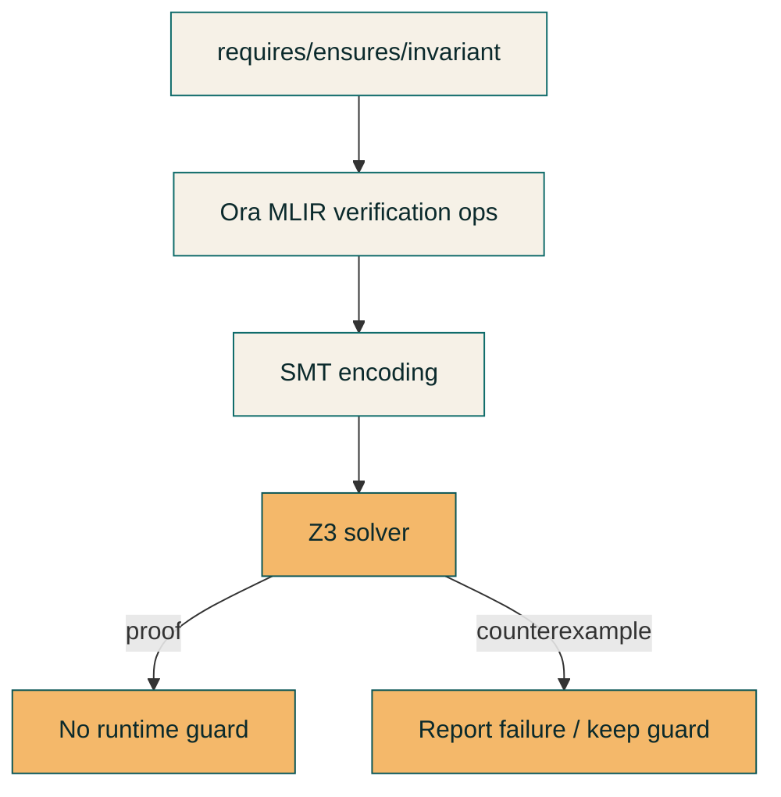

# Formal Verification

Formal verification is a primary Ora feature: correctness properties are\n+explicit, mechanically checked, and traceable through the compiler pipeline.

Research intent and current front-end integration.
No guarantee of end-to-end proofs for all programs.

## Model

Verification is expressed with specification clauses that live alongside code:

- `requires` for preconditions
- `ensures` for postconditions
- `invariant` for contract and loop invariants
- `assume` for verification-only constraints
- `assert` for runtime-visible checks (also modeled in verification)

These clauses are parsed and type-checked in the front end, then lowered into
verification-relevant IR for constraint extraction and SMT proof.

## Example

```ora
pub fn transfer(to: address, amount: u256) -> bool
    requires amount > 0
    requires balances[std.msg.sender()] >= amount
    ensures balances[std.msg.sender()] == old(balances[std.msg.sender()]) - amount
    ensures balances[to] == old(balances[to]) + amount
{
    // implementation
}
```

## Verification flow



## Implemented today

- Specification clauses are recognized by the parser and type resolver.
- Constraints are carried into Ora MLIR using verification ops.
- Refinement constraints that cannot refine types become SMT-only assumptions
  rather than being dropped.
- SMT counterexamples are surfaced when proofs fail.

## Next focus

- Default SMT discharge for refinement guards.
- Stronger propagation across control-flow joins.
- End-to-end proof reporting in the backend pipeline.

## Open questions

- Which constraints should refine types vs remain SMT-only?
- How should refinement propagation behave across control-flow joins?
- What is the precise boundary between runtime checks and proof obligations?
- How should error unions and region effects integrate with proof obligations?

## Status

Formal verification is active. The pipeline focuses on front-end correctness and
faithful constraint extraction, with backend proof integration evolving
alongside the compiler.

## Evidence

- `docs/compiler/formal-verification.md`
- `docs/compiler/onboarding/09-z3-smt.md`
