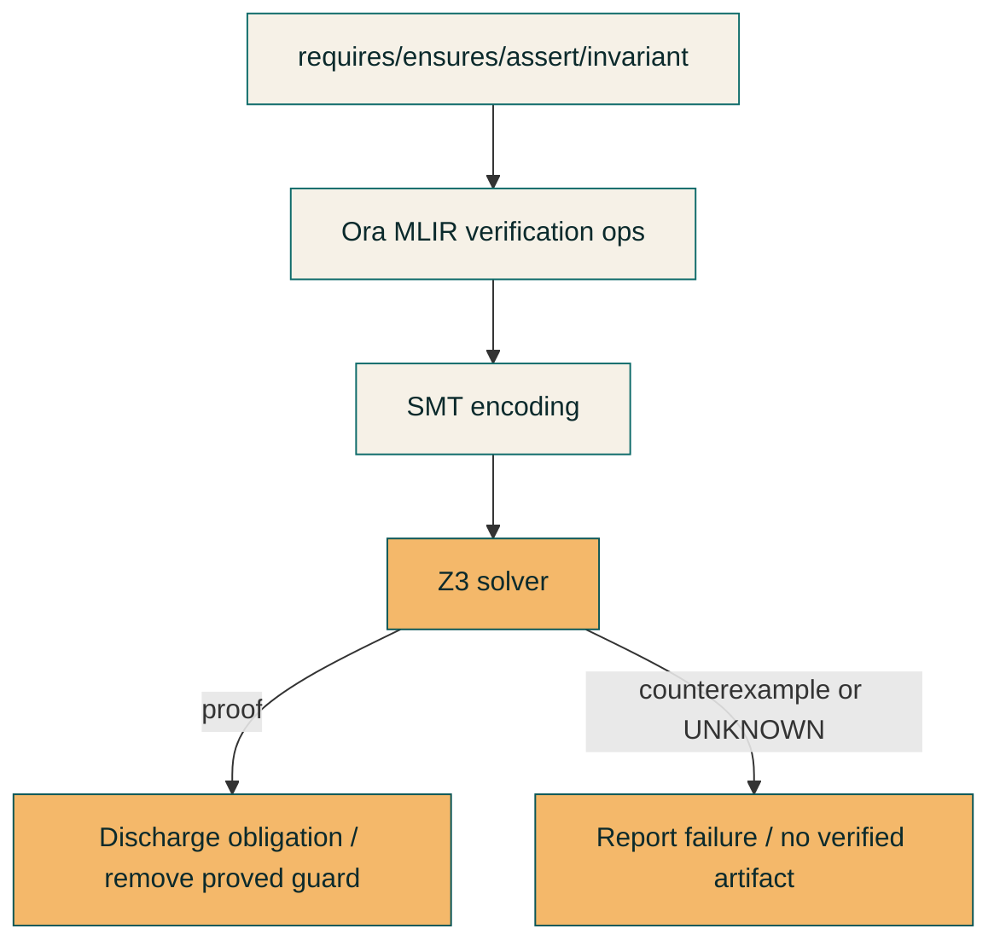

# Formal Verification

Formal verification is a primary Ora feature: correctness properties are
explicit, mechanically checked, and traceable through the compiler pipeline.

v0.2 verification is build-integrated: a full build runs the verifier, reports
counterexamples and proof trust, and refuses verified artifacts when required
proof obligations fail, degrade, or return `UNKNOWN`.

## Model

Verification is expressed with specification clauses that live alongside code:

- `requires` — preconditions that constrain the verified body and are enforced at public/call boundaries
- `guard` — runtime-enforced preconditions the function checks itself (reverts if false, informs the verifier)
- `ensures` — postconditions the function must satisfy on all return paths
- `invariant` — contract-level or loop-level properties that must hold across all state transitions
- `assume` — verification-only constraints (no runtime check)
- `assert` — runtime-visible checks also modeled as verification obligations

These clauses are parsed and type-checked in the front end, then lowered into
verification-relevant IR for constraint extraction and SMT proof.

## Example

```ora
pub fn transfer(to: address, amount: u256) -> bool
    requires balances[std.msg.sender()] >= amount
    guard amount > 0
    guard to != std.constants.ZERO_ADDRESS
    ensures balances[std.msg.sender()] == old(balances[std.msg.sender()]) - amount
    ensures balances[to] == old(balances[to]) + amount
{
    // implementation
}
```

## Verification flow


```mermaid
flowchart TB
  classDef core fill:#f6f1e7,stroke:#0e6b6a,color:#0b2a2c;
  classDef accent fill:#f4b86a,stroke:#0b5656,color:#0b2a2c;
  A[requires/ensures/assert/invariant] --> B[Ora MLIR verification ops]
  B --> C[SMT encoding]
  C --> D[Z3 solver]
  D -->|proof| E[Discharge obligation / remove proved guard]
  D -->|counterexample or UNKNOWN| F[Report failure / no verified artifact]
  class A,B,C core;
  class D,E,F accent;
```

## Implemented today

- Specification clauses are parsed, type-checked, and carried into Ora MLIR.
- Checked arithmetic, division, `assert`, `ensures`, loop invariants, callee
  preconditions, and active refinement guards become proof obligations.
- `requires` clauses become tracked assumptions for the verified body and are
  enforced at ABI/call boundaries.
- `ensures_ok` and `ensures_err` constrain success and error exits of
  Result/error-union functions.
- `old(expr)` denotes function-entry state for storage/frame reasoning.
- `modifies` clauses frame current-contract storage paths for callers.
- Z3 counterexamples are surfaced when obligations fail.
- Explain-mode reports expose assumption cores and vacuity risk.
- Encoding degradation, soundness losses, and `UNKNOWN` fail closed instead of
  being counted as verified.

## Status

Formal verification is active in the v0.2 build pipeline. It is not a formal
EVM-bytecode equivalence proof; the verifier trusts the MLIR-to-SMT encoder and
the lowering pipeline, and bytecode conformance tests cover representative
runtime behavior.

Ora also has two kernel-checked Lean lanes: a per-contract userland gate and a
repository-level compiler/model gate. See [Lean Verification: Userland and
Kernel Lanes](./lean-verification-lanes) for their commands, proof surfaces,
certificates, failure behavior, and exact trust boundaries.

## Evidence

- `docs/compiler/formal-verification.md`
- `docs/compiler/onboarding/09-z3-smt.md`
