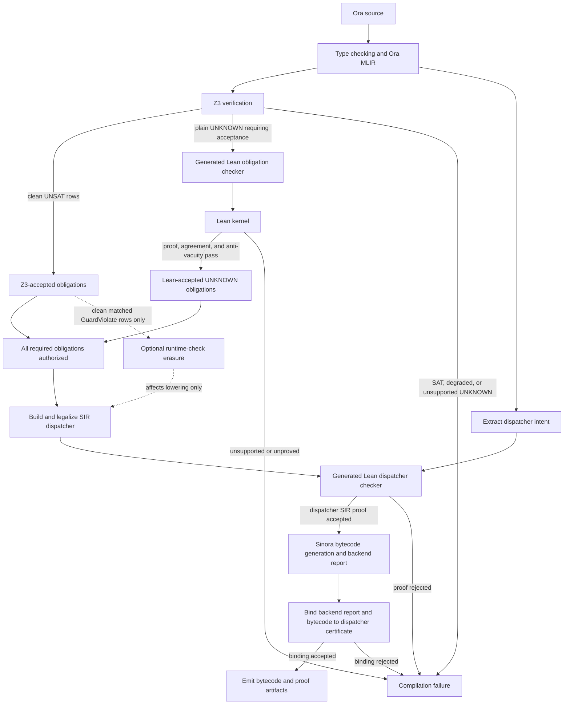

# Lean Verification: Userland and Kernel Lanes

Ora uses Lean in two distinct formal-verification lanes:

| Lane | Scope | Command | Failure effect |
| --- | --- | --- | --- |
| **Userland** | One compiled contract | `ora --lean-proofs contract.ora` | No contract artifact is emitted |
| **Kernel** | Reusable compiler models, theorems, and compiler/spec snapshots | `zig build check-formal-sync` | The repository gate fails |

Both lanes are checked by the Lean kernel. The names describe their scope, not
different proof engines. Userland proves properties of a particular compiled
contract. Kernel proves reusable facts about Ora's formal models and checks
selected compiler facts against those models.

This distinction is also a trust boundary. The kernel lane is **not** a claim
that the entire Zig/C++ compiler has been translated to Lean or verified. The
userland lane is **not** a complete source-to-EVM semantics proof. Each lane
states and checks a narrower claim that the current implementation can support.

## Shared discipline

The two lanes follow the same rules:

1. The compiler may emit **data**, but the trusted proposition and checker live
   in hand-written Lean.
2. Unsupported syntax does not become an easier proposition. It becomes a
   visible failure.
3. Generated proof modules are checked for forbidden proof shortcuts such as
   `sorry`.
4. A proof is accepted only when its identities, manifest, and relevant
   compiler evidence agree.
5. Failure is fail-closed: userland withholds artifacts; kernel fails the
   repository gate.

## Prerequisites

The repository pins Lean in `formal/lean-toolchain`. The current formal project
is mathlib-free and uses Lean 4 directly.

Install Lean with `elan`, then make sure `lake` is on `PATH`:

```bash
export PATH="$HOME/.elan/bin:$PATH"
cd formal
lake --version
```

The repository scripts add `$HOME/.elan/bin` automatically. Direct `ora
--lean-proofs` invocations still need to be able to find `lake`.

## Userland lane

The userland lane is part of contract compilation:

```bash
ora --lean-proofs contract.ora
```

`--lean-proofs` and `--lean-proofs=userland` are equivalent. The normal path is
automatic: the compiler generates the Lean inputs, runs Lean, and either emits
the contract artifacts or fails the compilation. It does not ask the user to
run a second proof command.



This ordering is load-bearing. In a verified build, a failed Z3/Lean obligation
gate returns before SIR dispatcher construction and before Sinora bytecode
generation. Lean can complete artifact authorization for eligible Z3
`UNKNOWN`s, but only clean, identity-matched Z3 `GuardViolate` results can
authorize runtime-check erasure. After SIR construction, the dispatcher proof
and bytecode-binding check form a second gate before artifacts are written.

### Z3 and Lean obligations

Z3 remains Ora's primary per-contract solver. When a required plain query is
`UNKNOWN`, the compiler checks whether the query is in the supported Lean
fragment. Supported queries are translated into a generated Lean proof module
and attempted automatically.

For a logical goal `G` under assumptions `A`, the SMT lane checks the
refutation form:

```text
A ∧ ¬G
```

The result is interpreted as follows:

| Z3 result | Meaning | Compiler action |
| --- | --- | --- |
| `UNSAT` | No counterexample exists under the encoded assumptions | Accept the query, subject to the soundness and vacuity gates |
| `SAT` | Z3 found a counterexample | Reject verification and report the model |
| `UNKNOWN` | Z3 did not establish either result | Attempt the Lean lane only when the query has a supported, total Lean denotation |

Lean does not prove the string `Z3 returned UNKNOWN`. It proves the proposition
denoted by the compiler's formal query. The proof checker must therefore
establish that the Lean proposition and the live Z3 query identify the same
assumptions and goal before the proof can authorize an artifact.

Acceptance requires all targeted queries to be covered and proved. A missing
identity, unsupported denotation, failed proof, rejected axiom, or unmatched
agreement row blocks artifact emission. Lean is not used to relabel an
unsupported Z3 result as success.

The generated module is temporary. The durable evidence is the compiler report
and, when Lean had obligation targets to discharge, the
`<contract>.lean.proof.json` certificate.

An advanced legacy path can consume externally supplied proof rows, but it is
not the normal user workflow. The default userland mode is one compilation,
one automatic proof attempt, and one accept-or-reject result.

### Z3/Lean agreement bridge

The handoff from Z3 to Lean is not a source-location or theorem-name match. It
uses a first-class formal identity carried through both encoders:

1. The obligation collector assigns query, assumption, and target identifiers
   once.
2. The live Z3 prepared row records those identifiers and its solver result.
3. The Lean manifest uses the same identifiers to reconstruct the proposition.
4. An accepted Lean proof target must have exactly one corresponding agreement
   row. Missing and duplicate rows both fail.
5. Lean independently resolves the identifiers, checks structural
   well-formedness, and denotes the assumptions and target.

This closes two common false-agreement paths: fuzzy source-location matching
and two independent compiler walks that happen to assign the same numeric ids.

For the canonical subset, Ora adds a byte-level crosscheck. A separate canonical
Z3 adapter rebuilds `assumptions ∧ ¬goal`; its constraint count and solver-text
hash must match the live prepared row. This check is enabled only for query
shapes where byte parity is meaningful and for rows marked annotation-pure.
Rows containing ambient encoder context, resource-state threading, or
structural effect-frame reasoning are not falsely presented as byte-identical
queries.

Canonical parity is a strengthening of the handoff, not its definition. Query
identity, total Lean denotation, and proof checking remain required even when a
shape is outside the byte-parity fragment.

### Assumptions and anti-vacuity

Lean proves a goal under the assumptions attached to that formal query. This
creates an important danger: contradictory assumptions imply every
proposition. Ora therefore checks the premise set for vacuity before accepting
a proof. A query with assumptions such as `x = y` and `x != y` cannot be
accepted merely because Lean can derive its target from contradiction.

The totality lockstep gate covers both positions of this seam:

- formulas used as proof targets; and
- formulas used as assumptions.

The Zig support classifier and Lean denotation must agree on the generated
fixture matrix in both directions. A supported compiler row that stops denoting
in Lean fails the repository gate instead of becoming `False` in a way that
could make another implication vacuous.

Effect-frame rows are handled as a separate structural category. They do not
pretend to have a live Z3 row when the architecture never generated one. Their
Lean checker recomputes the frame relation and evidence discipline directly,
while the overlay continues to require prepared Z3 rows for ordinary logical
queries.

### Dispatcher proof

With `--lean-proofs`, Ora also proves the compiled contract's dispatcher. This
gate runs even when Z3 produced no `UNKNOWN` obligation.

The generated checker establishes these contract-specific conclusions:

| Conclusion | Meaning |
| --- | --- |
| `current_dispatcher_network_matches` | The emitted hot/cold dispatcher topology represents the intended selector network |
| `current_dispatcher_unknown_selectors_revert` | Unknown selectors cannot be accepted as known calls |
| `current_dispatcher_planner_reference_matches` | The plan emitted by the compiler equals the Lean reference planner's choice for this contract |
| `current_dispatcher_manifest_rows_match` | Emitted cases, labels, route indices, strategy shape, and planner evidence satisfy the formal manifest checks |
| `current_dispatcher_builder_correct` | The emitted plan builds a strategy-well-formed abstract dispatcher |

These are the composed conclusions printed in the terminal summary. The
certificate additionally records the component theorems from which these
conclusions are assembled, so its theorem list is intentionally longer than
this table.

The last theorem uses a universal kernel-lane theorem: the Lean reference
planner always returns an admissible plan for the abstract dispatcher builder.
The userland checker supplies the missing per-contract correspondence by
checking that the production compiler emitted that reference plan.

### SIR and bytecode boundary

Successful output currently says:

```text
Lean dispatcher userland proof accepted (SIR + bytecode)
```

The parenthetical must be read precisely:

- **Lean proves the SIR dispatcher facts and their abstract model claims.**
- **Compiler-side checks bind those facts to the backend report and bytecode.**

The backend check confirms that strategies, selectors, labels, and route
indices match the proven SIR switches, requires a valid lowering-template
attestation, and records SHA-256 bindings for the report and bytecode. This is
stronger than an unbound SIR proof, but it is not an additional Lean theorem
over a complete EVM bytecode semantics.

### Running it

From a repository build:

```bash
export PATH="$HOME/.elan/bin:$PATH"
./zig-out/bin/ora --lean-proofs \
  -o artifacts/erc20-verified \
  ora-example/apps/erc20.ora
```

A successful dispatcher run prints the Lean process status and each accepted
conclusion:

```text
Lean checker output:
  exit status: 0
  diagnostics: none
Lean dispatcher verification summary:
  proof surface: dispatcher_userland
  input: 2 switch(es), 11 case(s)
  kernel-checked conclusions:
    - current_dispatcher_network_matches
    - current_dispatcher_unknown_selectors_revert
    - current_dispatcher_planner_reference_matches
    - current_dispatcher_manifest_rows_match
    - current_dispatcher_builder_correct
Lean dispatcher userland proof accepted (SIR + bytecode)
```

The output directory can contain:

| Artifact | Purpose |
| --- | --- |
| `<contract>.smt.report.md` | Human-readable Z3 and verification report |
| `<contract>.smt.report.json` | Machine-readable verification report |
| `<contract>.lean.proof.json` | Lean obligation certificate, emitted when Lean discharged targeted queries |
| `<contract>.lean.dispatcher.proof.json` | Dispatcher theorem list, Lean version, manifest hash, backend-report hash, and bytecode hash |
| Contract bytecode and ABI | Emitted only after the required gates authorize artifacts |

The dispatcher certificate currently uses schema version 1 and identifies the
proof surface as `dispatcher_userland`.

### Failure behavior

Userland proof failure is a compiler error, not advisory output. Examples
include:

- `lake` is unavailable;
- a required Z3 `UNKNOWN` is outside the Lean fragment;
- a generated proposition does not denote;
- Lean cannot prove every targeted query;
- the obligation-proof axiom audit rejects a proof;
- the emitted dispatcher differs from the Lean reference planner;
- dispatcher SIR facts disagree with the backend report; or
- the bytecode/report binding check fails.

In these cases Ora reports the reason and does not emit the verified contract
artifacts.

## Kernel lane

The kernel lane runs once for the repository state, not once per contract:

```bash
zig build check-formal-sync
```

The contract CLI deliberately rejects `--lean-proofs=kernel` and
`--lean-proofs=both`. Those spellings do not create a second kind of contract
certificate. Compiler/model theorems and synchronization belong in the
repository gate, where one change is checked against the entire formal tree.

### Gate stages

`check-formal-sync` performs four stages:

1. **Regenerate snapshots.** Compiler-owned emitters produce literal data for
   the type universe, declaration environment, type relations, dispatcher
   strategies and tables, Sinora backend facts, storage disjointness, and
   obligation totality.
2. **Lint generated data.** Snapshots may contain data definitions, not
   theorems, axioms, `sorry`, instances, imports, or proof tactics.
3. **Check drift and build.** Committed snapshots must match current compiler
   output, then `lake build` kernel-checks the complete `Ora` root.
4. **Audit axioms.** A generated whole-tree audit rejects theorem dependencies
   outside the permitted trust surface. The present allowed dependencies are
   Lean's `propext` and `Quot.sound`.

`zig build gate` includes this check as part of the wider compiler gate.

### What the kernel lane contains

The checked root currently includes several kinds of result:

- abstract dispatcher semantics, guard necessity, builders, and strategy
  well-formedness;
- a universal theorem that the executable **Lean reference planner** returns an
  admissible plan for every modeled input;
- compiler/spec synchronization facts for dispatcher constants, tables, type
  identifiers, declarations, and type relations;
- EVM-width `U256` arithmetic semantics and pinned edge cases;
- obligation, assumption, effect-frame, and resource-goal denotations;
- storage-place identity and disjointness checks;
- totality agreement between the Zig support classifier and Lean denotation on
  the generated fixture matrix;
- resource-state and conservation theorems; and
- theorem helpers harvested from real proof fixtures.

Generated snapshots are deliberately untrusted data. The hand-written Lean
modules decode that data and state the propositions checked by the kernel.

### Universal does not mean compiler-wide

For example, this theorem is universal over the Lean planner model:

```lean
theorem planner_reference_builder_correct [Inhabited Label]
    (input : Input Label) :
    Ora.Dispatcher.StrategyWF
      input.cases
      (choosePlanReference input).toBuilderPlan
```

It proves that every result of `choosePlanReference` is builder-correct. It does
not prove that the Zig planner implementation is extensionally equal to the
Lean function for all possible programs. That connection is checked in the
userland lane for each compiled contract.

## How the lanes compose

The dispatcher is the clearest example:

1. The kernel lane proves the Lean reference planner and abstract builder are
   correct for every modeled input.
2. The userland lane extracts one contract's emitted dispatcher facts.
3. Lean checks that the emitted production plan equals the reference plan for
   those selectors and policy inputs.
4. The userland theorem instantiates the universal builder theorem for that
   contract.
5. Compiler-side checks bind the proven SIR facts to the backend report and
   bytecode hashes.

This composition removes a per-contract admissibility assumption. It does not
remove the per-contract compiler/reference correspondence check, and it does
not turn the extraction and lowering pipeline into a verified compiler.

## Solver and optimization boundary

Z3 and Lean cooperate, but they do not have identical authority:

- Z3 proves the ordinary verification workload and supplies counterexamples.
- Lean can discharge supported proof targets and can authorize artifact
  emission.
- Lean proof acceptance does **not** authorize runtime refinement-guard or
  resource-check erasure.
- Runtime-check erasure remains tied to clean, identity-matched Z3 results with
  no soundness loss or degraded enclosing verification result.

This separation prevents a newly supported Lean proposition from silently
changing generated bytecode.

## Claim matrix

| Claim | Current status |
| --- | --- |
| Lean reference planner always returns an admissible abstract plan | Proven universally in the kernel lane |
| One compiled contract's emitted dispatcher matches that reference plan | Checked by the userland lane |
| One compiled contract's dispatcher satisfies the abstract builder model | Proven by composing userland correspondence with the universal theorem |
| Dispatcher proof certificate is bound to the emitted backend report and bytecode | Checked and hashed compiler-side |
| Zig/C++ planner and extraction code are universally correct | **Not proven** |
| SIR lowering preserves a complete formal semantics through all later passes | **Not proven** |
| Ora has a whole-source-language preservation/progress theorem | **Not proven** |
| Every Ora feature has a total Lean denotation | **Not proven**; unsupported cases fail closed |
| Generated EVM bytecode is fully equivalent to the Ora source for every program | **Not proven** |

The residual trust base includes Lean's kernel, Z3 for solver-proved results,
the compiler's fact extraction and bytecode-binding checks, later lowering
outside formally modeled templates, and the specification-to-intent boundary.
It also includes the Lean reference planner as a hand-maintained specification
mirror of the Zig planner: its constants are kernel-synchronized, while its
branch-logic correspondence is checked per compiled contract rather than by a
universal Zig-to-Lean equivalence theorem.

## Useful commands

```bash
# Per-contract userland gate
ora --lean-proofs contract.ora

# Equivalent explicit spelling
ora --lean-proofs=userland contract.ora

# Repository kernel/model/snapshot gate
zig build check-formal-sync

# Wider repository gate, including formal sync
zig build gate

# Lean project only
cd formal && lake build
```

## Current research boundary

The current Lean lane is a growing set of connected formal components, not yet
a verified compiler. Important remaining work includes:

- source-language and execution semantics broad enough for whole-program
  theorems;
- stronger connections between type well-formedness and compiler acceptance;
- loop proof support beyond the current Z3-centered path;
- versioned/post-state storage semantics for written-path reads;
- proved lowering correspondence beyond selected structural/template checks;
  and
- broader total denotation coverage without weakening fail-closed behavior.

For the language-level verification workflow, see [Formal
Verification](./formal-verification). For compiler internals and the trust
boundary, see the repository's `docs/compiler/trust-rails-reference.md` and
`docs/compiler/formal-lane-program-status.md`.
