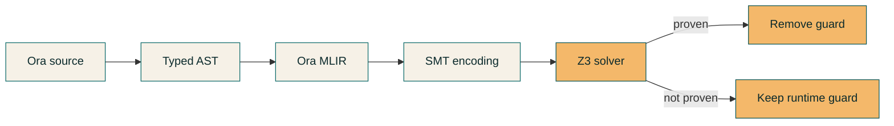

# SMT Verification

SMT verification is the enforcement engine for Ora’s specs and refinements.
It turns `requires`, `ensures`, `invariant`, and refinement guards into proof
obligations and eliminates runtime checks when proofs succeed.

## Implemented today

- Z3 verification pass runs after Ora MLIR emission.
- `requires`, `ensures`, and `invariant` clauses are encoded and checked.
- Counterexamples are surfaced when constraints fail.
- SMT-only assumptions are preserved when refinements cannot be inferred.

## Syntax (Defny-style)

Ora’s specification syntax follows a Defny-style layout: clauses attach to
functions or loops, and verification-only statements live in blocks.

```ora
pub fn transfer(to: address, amount: u256) -> bool
    requires amount > 0
    requires balances[std.msg.sender()] >= amount
    ensures balances[to] == old(balances[to]) + amount
{
    // ...
}
```

When SMT proves these clauses, the compiler removes the corresponding runtime
guards. If SMT cannot prove them, the checks remain in bytecode.

Example: if `requires amount > 0` is not implied by refinements or control
flow, the compiler emits a runtime guard such as:

```ora
if (amount < 1) {
    // runtime error / abort
}
```

### Where to put the code

- **Function clauses**: `requires`, `ensures`
- **Loop clauses**: `invariant` (placed on the loop header)
- **Block statements**: `assert`, `assume`, `havoc`
- **Quantifiers**: `forall`, `exists` inside clauses or ghost code

```ora
while (i < n)
    invariant(i <= n)
{
    // ...
}
```

```ora
assume(x >= 0);
assert(x >= 0);
havoc balance;
```

### Quantifiers

```ora
pub fn check_all(balances: map<address, u256>) -> bool
    requires forall addr: address where addr != std.constants.ZERO_ADDRESS
        => balances[addr] >= 0
{
    return true;
}
```

## Where it lives in the compiler

- Pass orchestration: `src/z3/verification.zig`
- Encoding: `src/z3/encoder.zig`
- Solver interaction: `src/z3/solver.zig`

## Proof flow



## Implementation details

- Pass runs in `src/z3/verification.zig` after Ora MLIR emission.
- Encoding is defined in `src/z3/encoder.zig` for Ora ops and types.
- Solver integration and models live in `src/z3/solver.zig`.

## Research direction

- Make refinement guards first-class SMT obligations by default.
- Provide a consistent “prove or keep runtime” policy.
- Expand SMT-driven pruning of unreachable branches.

## Evidence

- `docs/compiler/onboarding/09-z3-smt.md` (Z3 integration details)
- `docs/compiler/formal-verification.md` (FV surface and pipeline)
- `src/z3/encoder.zig` (MLIR-to-SMT encoding entry point)

## References

- `docs/compiler/onboarding/09-z3-smt.md`
- `docs/compiler/formal-verification.md`
- `docs/compiler/refinement-types-strategy.md`
