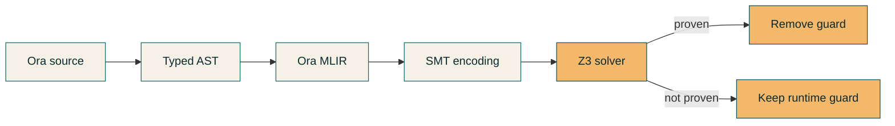

# SMT Verification

SMT verification is the enforcement engine for Ora’s specs and refinements.
It uses Z3 to prove obligations from `ensures`, `assert`, loop invariants,
checked arithmetic, division safety, callee preconditions, and active refinement
guards. `requires` clauses are tracked assumptions for the verified body and
are enforced at public/call boundaries.

## Implemented today

- Z3 verification runs after Ora MLIR emission.
- Full build mode gates verified artifacts on proof success.
- Counterexamples are surfaced when obligations fail.
- Explain mode exposes unsat cores and vacuity risk.
- Degradation, soundness losses, and `UNKNOWN` fail closed.
- Proved refinement guards can be removed; unproved guards remain runtime
  checks.

## Syntax

Specification clauses attach to functions or loops:

```ora
pub fn transfer(to: address, amount: u256) -> bool
    requires balances[std.msg.sender()] >= amount
    guard amount > 0
    guard to != std.constants.ZERO_ADDRESS
    ensures balances[to] == old(balances[to]) + amount
{
    // ...
}
```

- `requires` — caller/public-boundary precondition and tracked assumption for the verified body
- `guard` — runtime-enforced check: the function reverts if the condition is false, and the SMT solver assumes the condition holds after the check
- `ensures` — postcondition checked by the SMT solver across all return paths

When SMT proves a refinement guard is always satisfied, the compiler can elide
the corresponding runtime check. If it cannot prove the guard, the check remains
in bytecode.

### Where to put the code

- **Function clauses**: `requires`, `guard`, `ensures`
- **Loop clauses**: `invariant` (placed on the loop header)
- **Block statements**: `assert`, `assume`, `havoc`
- **Quantifiers**: `forall`, `exists` inside clauses or ghost code

```ora
while (i < n)
    invariant i <= n
{
    // ...
}
```

```ora
assume(x >= 0);
assert(x >= 0);
havoc balance;
```

### Quantifiers

```ora
pub fn check_all(balances: map<address, u256>) -> bool
    requires forall addr: address where addr != std.constants.ZERO_ADDRESS
        => balances[addr] >= 0
{
    return true;
}
```

## Where it lives in the compiler

- Pass orchestration: `src/z3/verification.zig`
- Encoding: `src/z3/encoder.zig`
- Solver interaction: `src/z3/solver.zig`

## Proof flow


```mermaid
flowchart LR
  classDef core fill:#f6f1e7,stroke:#0e6b6a,color:#0b2a2c;
  classDef accent fill:#f4b86a,stroke:#0b5656,color:#0b2a2c;
  A[Ora source] --> B[Typed AST]
  B --> C[Ora MLIR]
  C --> D[SMT encoding]
  D --> E[Z3 solver]
  E -->|proven| F[Remove guard]
  E -->|not proven| G[Keep runtime guard]
  class A,B,C,D core;
  class E,F,G accent;
```

## Implementation details

- Pass runs in `src/z3/verification.zig` after Ora MLIR emission.
- Encoding is defined in `src/z3/encoder.zig` for Ora ops and types.
- Solver integration and models live in `src/z3/solver.zig`.

## Reports

Use:

```bash
ora build path/to/contract.ora --explain --emit=smt-report
```

The report records proof success, verification trust, query fragments, failed
obligations, counterexamples, degradation/soundness-loss labels, and vacuity
information. A proof that depends on contradictory assumptions is reported as a
vacuous-risk result, not as full verification.

## Evidence

- `docs/compiler/onboarding/09-z3-smt.md` (Z3 integration details)
- `docs/compiler/formal-verification.md` (FV surface and pipeline)
- `src/z3/encoder.zig` (MLIR-to-SMT encoding entry point)

## References

- `docs/compiler/onboarding/09-z3-smt.md`
- `docs/compiler/formal-verification.md`
- `docs/compiler/refinement-types-strategy.md`
